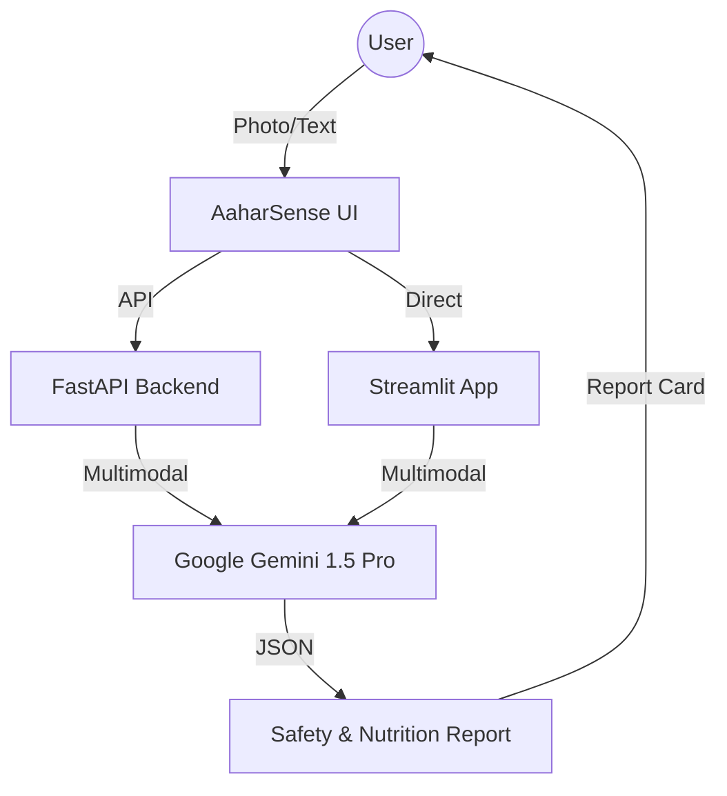

# AaharSense AI — Food Safety & Nutritional Intelligence 🍛🔬

> **An intelligent food safety companion designed for the Indian market. Leveraging Google Gemini AI to detect adulterants, analyze nutrition, and provide regional food safety guidance in English, Kannada, and Hindi.**

[](https://amd.com)
[](https://ai.google.dev)
[](https://aaharsense.ai)

---

## 🎯 The Mission
AaharSense AI empowers Indian consumers to navigate the complexities of food safety. With rising concerns about food adulteration (spices, milk, oils) and the need for accurate nutritional tracking of regional cuisines, AaharSense provides a clinical-grade, AI-powered tool accessible to everyone.

---

## 🧠 Core Features

1. **Adulteration Detection** — Identify common adulterants (metanil yellow, chalk, palm oil) through visual analysis and cross-referencing regional food safety standards.
2. **Clinical Nutritional Profiling** — Real-time macro/micronutrient estimation for Indian dishes (from Poha to Palak Paneer) using Gemini 1.5 Pro.
3. **Safety Scoring** — A 0-100 proprietary score evaluating food based on purity, processing levels, and preparation hygiene.
4. **Multilingual Accessibility** — Native support for **Kannada** and **Hindi**, ensuring the rural and urban population can access critical safety data.
5. **Home Safety Tests** — AI-suggested simple household tests to verify food purity.

---

## 🏗️ Architecture
AaharSense AI is a hybrid platform offering a high-performance **React frontend** and a lightweight **Streamlit application** for quick access, both powered by a **FastAPI backend**.



---

## 🛠️ Tech Stack

| Layer | Technology |
|-------|-----------|
| **AI Engine** | Google Gemini 1.5 Pro Vision |
| **Frameworks** | React 18 (Frontend) | FastAPI (Backend) | Streamlit (Quick App) |
| **Styling** | AaharSense Design System (Modern Corporate Minimalism) |
| **Deployment** | Google Cloud Run (Containerized) |
| **Database** | Google Cloud Firestore (Health Logs & Profiles) |

---

## 🚀 Getting Started

### Prerequisites
- Python 3.11+
- Node.js 18+
- Gemini API Key ([Get it here](https://aistudio.google.com/))

### Installation
1. **Clone & Setup Environment**
   ```bash
   git clone https://github.com/pabt2/AaharSense-AI.git
   cd AaharSense-AI
   cp .env.example .env # Add your GEMINI_API_KEY
   ```

2. **Run Streamlit (Recommended for Quick Start)**
   ```bash
   pip install -r requirements.txt
   streamlit run app.py
   ```

3. **Run Full-Stack (React + FastAPI)**
   ```bash
   # Backend
   cd backend && uvicorn app.main:app --reload --port 8080
   
   # Frontend
   cd frontend && npm install && npm run dev
   ```

---

## 📜 Safety Disclaimer
AaharSense AI provides estimates and risk assessments based on AI vision and data patterns. It is intended for educational and preliminary screening purposes and is not a substitute for certified laboratory testing or professional medical advice.

---

## 📄 License
MIT License — Built for AMD Ideathon 2024.
